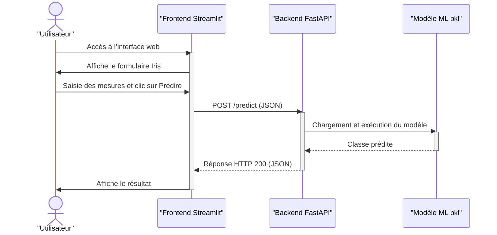
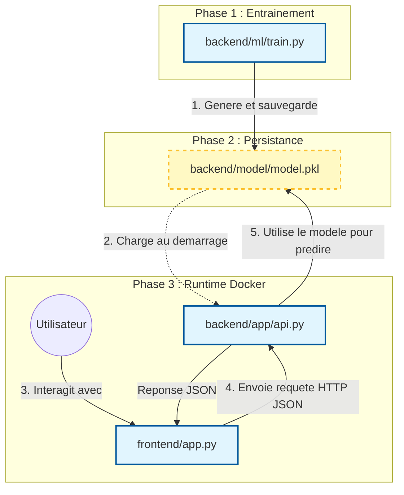
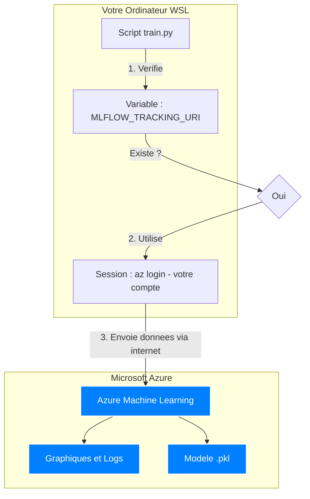

# Iris ML - Pipeline CI/CD


##  Objectif
Ce projet est une démonstration **MLOps** complète.
Il permet de prédire l'espèce d'une fleur d'Iris via une interface web, en utilisant un modèle de Machine Learning conteneurisé et déployé automatiquement via un pipeline CI/CD.

## Version déployée (Microsoft Azure)

[Iris ML](https://iris-ml-front-f8djewduezbehwe3.francecentral-01.azurewebsites.net/)

## Architecture
Le projet fonctionne en **micro-services** orchestrés par Docker :

```
iris-ml/
├── .github/
│   └── workflows/
│       └── main.yml         # Pipeline CI/CD (GitHub Actions)
│
├── backend/                 # Service API & Machine Learning
│   ├── app/
│   │   ├── __init__.py
│   │   └── api.py           # Code de l'API (FastAPI)
│   ├── ml/
│   │   └── train.py         # Script d'entraînement du modèle (Via MLflow)
│   ├── model/
│   │   └── model.pkl        # Le modèle entraîné (Artefact, issu de MLflow)
│   ├── tests/
│   │   ├── __init__.py
│   │   └── test_api.py      # Tests unitaires (Pytest)
│   ├── Dockerfile           # Instruction de build pour l'image Backend
│   └── requirements.txt     # Dépendances (FastAPI, scikit-learn...)
│
├── frontend/                # Service Interface Utilisateur
│   ├── app.py               # Application Streamlit
│   ├── Dockerfile           # Instruction de build pour l'image Frontend
│   └── requirements.txt     # Dépendances (Streamlit, requests)
│
├── docs/                    # Sources de la documentation (Markdown)
├── docker-compose.yml       # Orchestration des conteneurs (Local)
├── mkdocs.yml               # Configuration du site de documentation
└── .gitignore               # Fichiers ignorés par Git (.venv, secrets...)
```

## Diagramme de séquence



## Interactions



## Installation

Prérequis: Docker Desktop et Git

```bash
git clone https://github.com/GaetanCSimplon/iris_ml.git
cd iris_ml
```

## Lancement

- Méthode make

```bash
make run
```

- Methode Docker

```bash
docker compose up --build
```

## Accès

Une fois lancé, ouvrez votre navigateur :
- Application : http://localhost:8501
- Documentation API : http://localhost:8000/docs

## Documentation 

https://gaetancsimplon.github.io/iris_ml/

## Bonus : Azure ML Tracking (branche ml_azure_tracking)

Le tracking des expériences est configuré pour fonctionner avec **Azure Machine Learning**.

**Note technique :**
L'automatisation complète de l'entraînement via GitHub Actions nécessiterait la création d'un *Service Principal* Azure.
En raison des restrictions de permissions sur le compte étudiant (droits Active Directory limités), cette étape n'a pas pu être implémentée dans le CI/CD.

Cependant, le tracking fonctionne parfaitement en **lancement local authentifié** (`az login`), permettant de centraliser les logs d'expérience sur le cloud Azure.

[Lien Azure ML - Iris ML](https://ml.azure.com/?wsid=/subscriptions/fbf86e5f-ad89-41dd-bcc2-4fb5e64140b0/resourceGroups/gcourtieuRG/providers/Microsoft.MachineLearningServices/workspaces/Iris-ML&tid=a2e466aa-4f86-4545-b5b8-97da7c8febf3)

**Fonctionnement**



